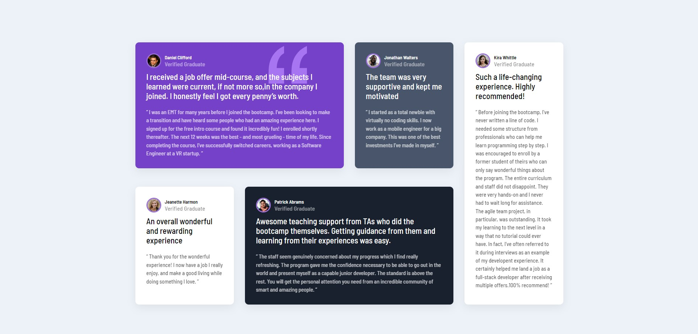

# Frontend Mentor - Testimonials grid section solution

This is a solution to the [Testimonials grid section challenge on Frontend Mentor](https://www.frontendmentor.io/challenges/testimonials-grid-section-Nnw6J7Un7).

## Table of contents

- [Overview](#overview)
  - [The challenge](#the-challenge)
  - [Screenshot](#screenshot)
  - [Links](#links)
- [My process](#my-process)
  - [Built with](#built-with)
  - [What I learned](#what-i-learned)
- [Author](#author)

## Overview

### The challenge

Users should be able to:

- View the optimal layout for the site depending on their device's screen size

### Screenshot

### Links

- Solution URL: [Add solution URL here](https://www.frontendmentor.io/solutions/responsive-landing-page-using-css-grid-tBvfXjQPgT)
- Live Site URL: [Add live site URL here](https://macho-notebook.surge.sh/)

## My process

### Built with

- Semantic HTML5 markup
- CSS custom properties
- Flexbox
- CSS Grid
- Mobile-first workflow

### What I learned

I completed this page design using css. My aim here was to learn and reinforce my ability about the css grid features.

## Author

- Frontend Mentor - [@burcuozdmr](https://www.frontendmentor.io/profile/burcuozdmr)
- Linkedln - [Burcu Özdemir](https://www.linkedin.com/in/burcu-%C3%B6zdemir-339228237/)

